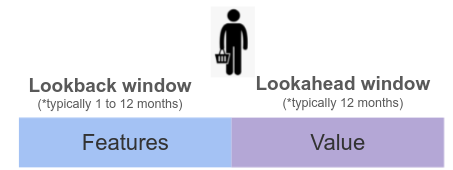
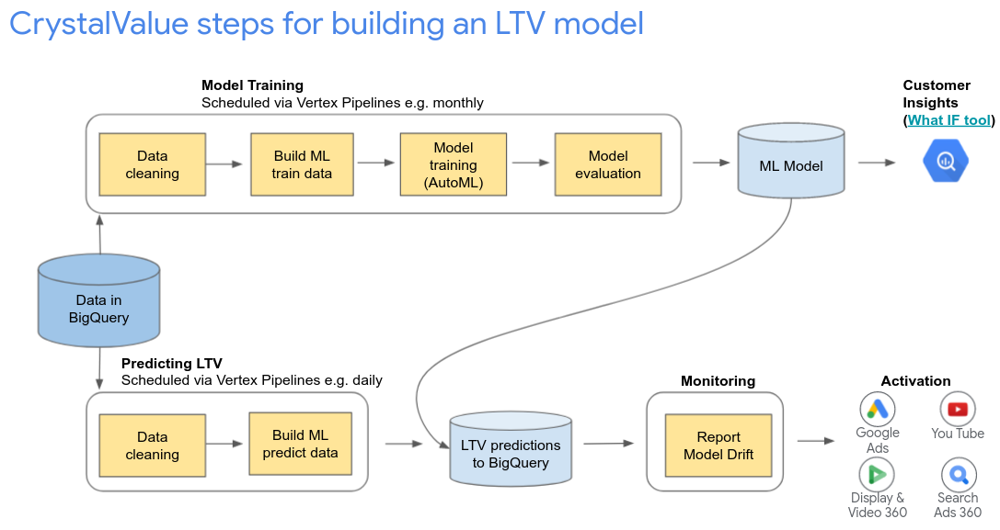
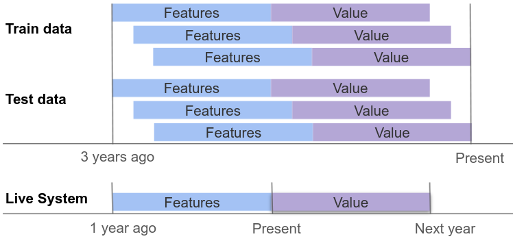
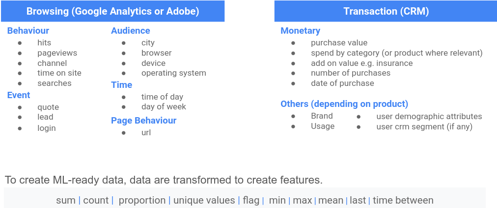

This is not an official Google product.

# Crystalvalue

## Overview

Crystalvalue is a Python library for running Predictive Customer LifeTime Value (pLTV) projects leveraging [Google Cloud Vertex AI](https://cloud.google.com/vertex-ai). It enables advertisers to quickly build effective pLTV machine learning models using 1st party data and to programmatically set up infrastructure for predictions, continuous pLTV insights and model maintenance. pLTV predictions are used by advertisers to boost digital advertising performance. Crystalvalue is primarily for advertisers who sell non-subscription based products and who have some repeat customers. Crystalvalue was created by experienced Google marketing data scientists and customer solutions engineers.

## Quick Start

There are two demos which walk users through using the library:

1. `demo_quick_start_notebook.ipynb` is a simple and quick tutorial that uses a generated synthetic dataset.
2. `demo_with_real_data_notebook.ipynb` is a tutorial using real transaction data (from Kaggle). It goes in to detail about how to carry out feature engineering, creating a model and scheduling predictions.

The demo notebooks can be repurposed to run on an advertiser's own data simply by changing the input table names and other relevant parameters. The demo is intended to be run inside of a [Google Cloud Notebook](https://cloud.google.com/vertex-ai/docs/general/notebooks).

## Requirements

* **User:** Crystalvalue users should be familiar with basic Python.
* **Data:** Crystalvalue expects that the input data is stored in Bigquery. The input data should either be transaction data or browsing data that includes customer purchases (e.g. from Google Analytics or Adobe). This is what an example input table could look like:

  customer_id  | date | transaction_value | country | operatingSystem | product_ids_purchased
  ------- | -------- | -------- | -------- | -------- | --------
  32670| 2021-06-04|11.23 | France| Android | 45,21,54
  33890 | 2021-10-09| 23.43|Germany|  iOS |  12,34,65
  32670 | 2021-09-02 | 42.11| France| Android| 12

Only the following columns are required: a customer ID column, a transaction date column and a transaction value column. However, it is recommended to use more information in pLTV models to improve model performance. Crystalvalue can automatically detect and ingest any number of additional data fields (such as 'country', 'operatingSystem' and 'product_ids_purchased') without further input from the user. There is no strict limit on the amount of historical data required, however, more data is usually better. For an advertiser seeking to predict 365 days in the future using data 365 days in the past they will require at least 2 years of data.

* **Google Cloud Platform:** The following APIs will be needed:
  * BigQuery
  * Vertex AI
  * (only for scheduling) Cloud Storage, Container Registry

## Outputs

The outputs of Crystalvalue are sent to Bigquery in your Google Cloud Project:

1. **Predicted Customer LifeTime Value** (in monetary terms) of your customers over the specified future period (default is one year). See the example table below. By defaut all your customers who had any activity (either transactions or browsing history) in the lookback period (default is one year) are included. This output table can be automatically refreshed every day. By default this table is called `crystalvalue_predictions`.

  customer_id  | lookahead_start | lookahead_stop | predicted_value
  ------- | -------- | -------- | -------- 
  32670| 2021-11-02| 2022-11-01| 156.76
  33890 | 2021-11-02| 2022-11-01| 170.23

2. **Data Statistics** of your input data. This is a Bigquery table with a single row with key information about your input dataset. This table is used to check whether additional data cleaning is necessary (e.g. negative prices or large outliers). By default this table is called `crystalvalue_data_statistics`. These statistics include:

  * number of customers
  * number of transactions
  * total analysis days and the number of dates with transactions
  * minimum and maximum transaction dates
  * lookahead return rate (i.e. the rate at which customer come back in the lookahead period)
  * lookahead mean returns (i.e. the average number of purchases made in the lookahead period)
  * conditional lookahead mean returns (i.e. the average number of purchases made in the lookahead period for those who did come back)
  * price distribution
  * number of transactions per customer distribution

3. **Model Evaluation** of your pLTV model. A Bigquery table with a row per model (which can useful for comparing subsequent model runs) with evaluation statistics about how your model performed on the test set. By default this table is called `crystalvalue_evaluation`. These columns include:  

  * time_run: The time that the model evaluation was run.
  * model_id: The ID of the Vertex AI Model.
  * spearman_correlation: The spearman correlation. This is a measure of how well the model ranked the Liftetime value of customers in the test set.
  * gini_normalised: The normalised Gini coefficient. This is a measure of how well the model predicted the Lifetime value of customers in the test set.
  * mae_normalised: The normalised Mean Average Error (MAE). This is a measure of the error of the model's predictions for Lifetime value in the test set.
  * top_x_percent_predicted_customer_value_share: The proportion of value (i.e. total profit or revenue) in the test set that is accounted for by the top x% model-predicted customers.

## What is Predictive Customer LifeTime Value?

A pLTV model predicts the ‘value’ (i.e. total profit or revenue) for each customer during a future time period (lookahead window) based on aggregated historical information (‘features’) during a past time period (lookback window).

For model training, ‘customer-windows’ are created which are made up of ‘features’ and ‘value’. For serving predictions, only the ‘features’ need to be created and the model predicts the future value.

  

## Solution description

Crystalvalue is an advertising solution that runs Predictive Customer LifeTime Value (pLTV) projects. It is a Python library that is intended to be run in a [Google Cloud Notebook](https://cloud.google.com/vertex-ai/docs/general/notebooks) within an advertiser's Google Cloud Platform account. Each step of the LTV modelling and prediction process is carried out programatically from the notebook, including scheduling predictions and model retraining. Crystalvalue uses the Vertex SDK for Python to interact with the user's Google Cloud Platform.

The steps in the Crystalvalue LTV process are outlined below and are set out in Figure 1.

**Figure 1**

  

* **Data cleaning**. Crystalvalue takes in a BigQuery table (e.g. data from Google Analytics or a CRM transaction dataset) and performs automated data checks. It will also output a table in your Bigquery dataset (default name: `crystalvalue_data_statistics`) with important statistics to help the user decide whether data cleaning is necessary (i.e. negative prices, extreme outliers). See the README section Outputs for which metrics are computed. 

* **Build ML data.** Crystalvalue takes in a BigQuery table (e.g. data from Google Analytics or a CRM transaction dataset) and outputs an ML ready dataset (default name for model training: `crystalvalue_train_data`, default name for prediction: `crystalvalue_predict_data`). For model training, this consists of a set of features and targets, and a column to indicate which rows are in the model training, test and validation sets. For prediction, this is just a set of features. See Figure 2. The same customer can be observed multiple times during different time windows for model training using monthly ‘sliding windows’. Crystalvalue automatically detects data types from the input Bigquery table schema and applies the appropriate feature transformations for any number of features. Default feature transformations for numerical and boolean columns are: MAX, MIN, AVG, SUM. Default feature transformations for string or categorical columns are an array aggregation. See Figure 3 for the typical features and transformations that can be used in LTV models. The processing is programmatically executed in the Python Bigquery API. This step also creates a column (`predefined_split_column`) which assigns customers to a training, validation and test set (split with random 15% of users as test, 15% in validation and 70% in training). Parameters that can be configured:
  *  days_lookback: # days to look back to create features (default: 365 days).
  *  days_lookahead: # days to look ahead to predict value (default: 365 days).
  *  features: Input data columns types (default: None, detected automatically).
  *  customer_id_column: The customer id column.
  *  date_column: The transaction date or timestamp column.
  *  value_column: The value column (i.e. transaction revenue/profit).
  *  ignore_columns: List of columns to ignore for feature engineering or prediction.
  *  write_executed_query_file: The file path to write the executed query (default: None).

  **Figure 2**

  

  **Figure 3**

  

* **Model Training**. Crystalvalue will programmatically train a Vertex AI Tabular AutoML model which will then be visible in the [Vertex AI dashboard](https://console.cloud.google.com/vertex-ai). The default names of the Vertex Dataset and Model are `crystalvalue_dataset` and `crystalvalue_model`. Once the model is trained, the feature importance will be shown in the Vertex AI model interface. The amount of node hours of training is specified using the `budget_milli_node_hours` argument (default is 1000 milli hours, which is equivalent to 1 hour). AutoML carries out impressive [data prepation](https://cloud.google.com/automl-tables/docs/data-best-practices#tables-does) before creating the model which means it can ingest features that are:
  * Plain Text (e.g. customer searches on your website)
  * Arrays (e.g. product pages visited)
  * Numerical columns (e.g. add on insurance cost)
  * Categorical columns (e.g. country)

* **Model evaluation.** Crystalvalue will run model evaluation on the test data (a set of customers that were not included in the model training) and report the metrics below. These metrics will be appended to the BigQuery table `crystalvalue_evaluation` (which will be created if it does not exist). See the README section Outputs for which metrics are computed.

* **Customer insights.** (WIP) Crystalvalue will connect your trained model to the What IF tool (see an [example here](https://pair-code.github.io/what-if-tool/demos/age.html)) which can help you understand the characteristics of your high LTV customers.

* **Predictions & Scheduling.** The model will make predictions for all the customers in the input table that have any activity during the lookback window. The pLTV predictions will be for the period from the last date in the input table (which is the start of the lookahead window) until the length of the lookahead window after the last date in the input table. Crystalvalue will provide you the option to schedule your predictions using the model on a regular basis using Vertex Pipelines from within the Notebook. See the example in the demo notebook which schedules predictions for 1am everyday. Once the schedule is set up, it will be visible in [Vertex Pipelines](https://cloud.google.com/vertex-ai/docs/pipelines/introduction).

* **Monitor feature skew and drift.** [Vertex AI Model Monitoring supports feature skew and drift detection for categorical and numerical input features.](https://cloud.google.com/vertex-ai/docs/model-monitoring/using-model-monitoring). This can be set up in the Vertex UI from your model's endpoint settings. Use this feature to set up [email alerts](https://cloud.google.com/vertex-ai/docs/model-monitoring/using-model-monitoring#email-alerts) for when the monitoring detects [Prediction Drift Training Prediction Skew](https://cloud.google.com/vertex-ai/docs/model-monitoring/using-model-monitoring#analyzing-skew-drift), which is a useful prompt to retrain the model using fresh data.

## The team

*  dfkelly@google.com
*  dulacp@google.com
*  pduque@google.com
*  sumedhamenon@google.com

